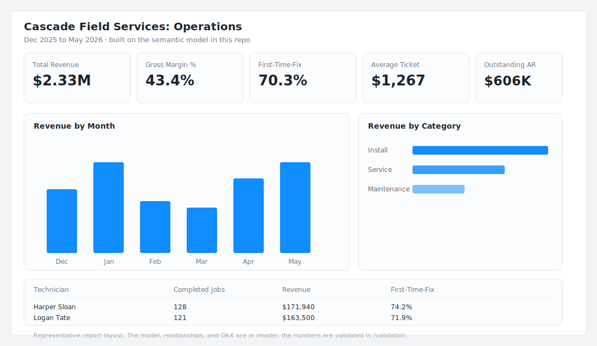
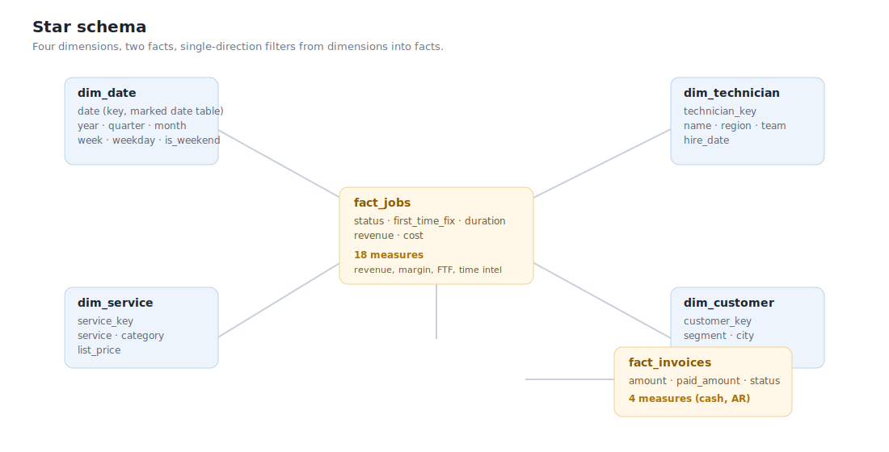

# powerbi-service-model

**A field-service company gets one trustworthy set of numbers: revenue, margin, first-time-fix, cash, and technician productivity, all reconciling from a single clean model.**

This is a Power BI semantic model for a fictional HVAC company, Cascade Field Services, built the way a model should be built. A clean star schema, conformed dimensions, and a documented DAX measure library where every number traces back to one definition. The whole thing is in text, so it reviews like code and the measure logic is tested in CI.



## Why this is built as code

A `.pbix` file is a binary box. You cannot diff it, review it, or test it. This model is in **TMDL**, the text format Power BI Project (`.pbip`) files use. That means the data model and every measure are readable, reviewable, and version-controlled.

- **The model** lives in [`model/model.tmdl`](model/model.tmdl): tables, columns, relationships, and the full measure set.
- **The measure library** is documented in [`model/measures.md`](model/measures.md): each measure, its DAX, and what it answers.
- **The validation harness** in [`validation/`](validation/) proves the logic. Each headline measure is re-implemented in SQL and run against the same data with DuckDB, and the values are asserted in CI. So the measures are not just written, they are checked.

## The model



Four dimensions and two facts. Filters flow one direction, from dimensions into facts, which keeps the model predictable and fast. `dim_date` is a proper date table, so time intelligence works.

| Table | Grain | Carries |
|---|---|---|
| `dim_date` | one row per day | calendar attributes, marked as the date table |
| `dim_technician` | one row per technician | region, team, hire date |
| `dim_service` | one row per service type | category, list price |
| `dim_customer` | one row per customer | segment, city |
| `fact_jobs` | one row per job | revenue, cost, duration, first-time-fix |
| `fact_invoices` | one row per invoice | amount, paid amount, status |

## The measures

Twenty-two measures across revenue and margin, volume and quality, workforce, time intelligence, and cash. They build on each other, so the base definitions are written once and everything references them. A few headlines from the sample data:

| Measure | Value |
|---|---|
| Total Revenue | $2,332,041 |
| Gross Margin % | 43.4% |
| First-Time-Fix Rate | 70.3% |
| Average Ticket | $1,267 |
| Outstanding AR | $605,721 |
| Collection Rate | 74.0% |

The full library, with DAX, is in [`model/measures.md`](model/measures.md).

## Run the validation

```bash
pip install duckdb pytest
python data/generate.py        # rebuild the sample data (already committed)
python validation/measures.py  # print every measure value
pytest                         # assert the measure logic and star-schema integrity
```

CI runs the same checks on every push, plus a determinism check that the generator reproduces the committed data exactly.

## Open it in Power BI

The model is the semantic layer. To build reports on it in Power BI Desktop, point a new model at the CSVs in `data/` with the same table and column names, or use the TMDL in `model/` as the model definition in a Power BI Project. The relationships and measures come with it. The report preview above shows the kind of report this model powers.

## Layout

```
powerbi-service-model/
  data/         star-schema CSVs and the seeded generator
  model/        the semantic model (TMDL) and the documented DAX library
  validation/   DuckDB harness that proves the measure logic, plus tests
  docs/         star-schema diagram and report preview
```

## Data and safety

The company and its data are invented. No real client data, no keys.

## License

MIT. See [LICENSE](LICENSE).

---

Built by [HenryLabs Consulting](https://github.com/HenryLabsConsulting). Data and automation engineering: BI, custom apps, and AI systems.
